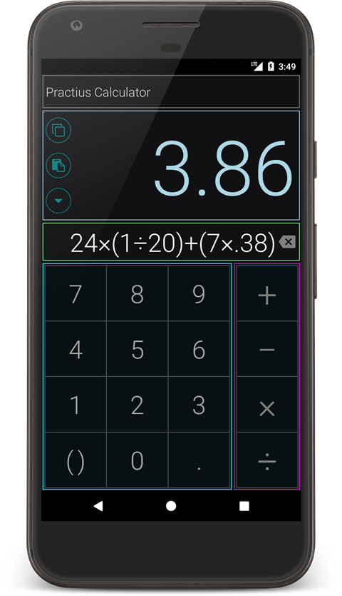

# Practius Calculator (React Native Showcase Project)

This is a cross-platform sample expression-based calculator implemented with the react native library.

The purpose of this project is to showcase some of the latest best practices recommended in the RN community.

This project also uses some recommended ESLint and Prettier configurations with git hooks (husky and lint-staged).

To make this simple and accessable, I have decided not to include Redux/MobX and go with pure react native. The project has proper configurations for Flow and Jest but they are not implemented for the same reason.

  

Some best practices and patterns currently implemented:

 - Auto-bound ES6 arrow functions and ES6 style components
 - Container and functional (presentational) components pattern
 - Functional state and decoupled state changes
 - Module aliasing to get rid of deep relative paths in imports (package.json module paths)
 - SystemJS config to make editors (such as WebStorm) understand package.json module paths
 - Use of propTypes and defaultProps
 - Practical folder hierarchy optimized for developer time (component oriented directories)
 - ESLint and Prettier setup with auto hooks

Dependencies:

 - mathjs (to evaluate expressions)
 - react-native-vector-icons (for icon buttons)

DevDependencies:

 - babel-eslint, babel-jest, babel-preset-flow, babel-preset-react-native
 - eslint, eslint-config-airbnb, eslint-config-prettier, eslint-plugin-flowtype, eslint-plugin-import, eslint-plugin-jsx-a11y, eslint-plugin-react, lint-staged, prettier
 - flow-bin, husky, jest, react-test-renderer, systemjs

